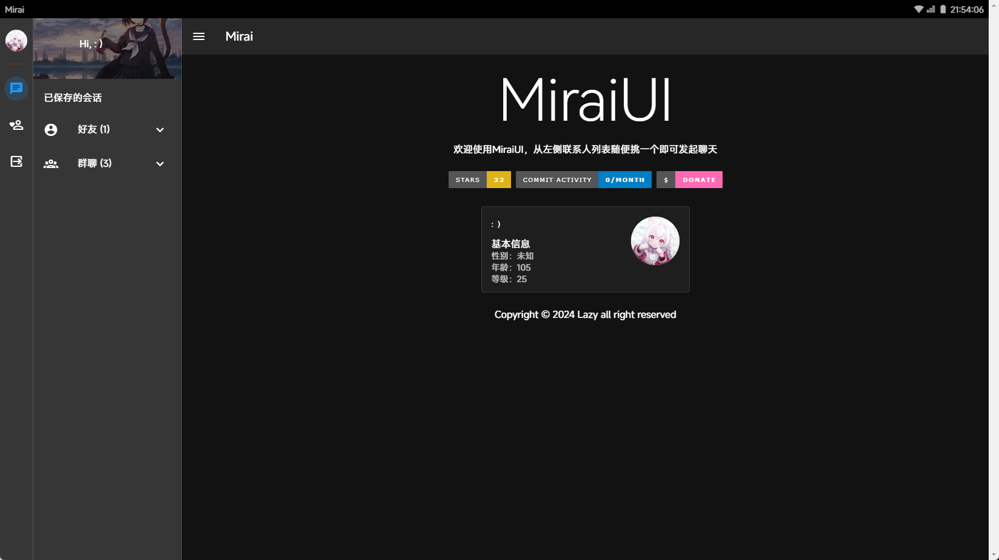
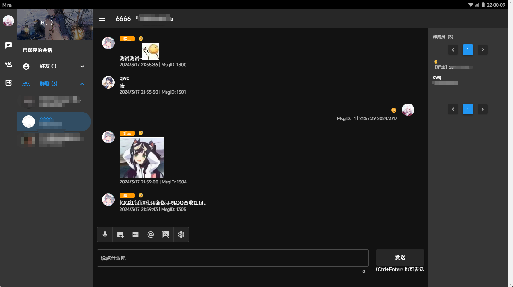

# Mirai UI

一个基于 [Mirai-http-api](https://docs.mirai.mamoe.net/mirai-api-http/) 的 WebQQ

## 这有啥用

能在网页操作 Mirai 机器人。

## 运行环境

任意支持静态 html 托管的服务器，无需 php，mysql 等复杂环境

## 截图



## 如何使用

1. 按照如下配置好[Mirai-http-api](https://docs.mirai.mamoe.net/mirai-api-http/)插件（仅供参考，请勿直接复制粘贴此文本）

```yaml
## 必须开启http和ws
adapters:
  - http
  - ws

## 开启认证，并设置key
enableVerify: true
verifyKey: 1234567890

adapterSettings:
  http:
    ## http服务器地址
    host: localhost
    port: 2345
    cors: [*]
  ws:
    ## 保持与http一致
    host: localhost
    port: 2345
    reservedSyncId: -1
```

2. 从`release`页面下载编译好的压缩包，上传到任意网站服务器（不支持放到二级目录）
3. 访问网站，输入相关信息，点击验证即可

#### 手动编译

```bash
# 克隆仓库到本地
git clone https://github.com/LazyCreeper/MiraiUI
# 安装依赖
npm i
# 编译
npm run build
```

## 目前已经实现的功能

<details>
  <summary>点击展开</summary>

- **获取账号信息**
  - 获取好友列表
  - 获取群列表
  - 获取群成员列表
  - 获取 Bot 资料
  - 获取好友资料
  - 获取群成员资料
- **消息发送与撤回**

  - <details>
    <summary>发送好友消息</summary>

    - 文本
    - 语音
    - 图片
    - 戳一戳
    - XML
    </details>

  - <details>
    <summary>发送群消息</summary>

    - 文本
    - 语音
    - 图片
    - @
    - XML
    </details>

  - 撤回消息

- **群管理**

  - 禁言群成员
  - 解除群成员禁言
  - 全体禁言
  - 解除全体禁言
  - 获取群员资料

- **其他**
  - 聊天记录自动保存到浏览器(`localStorage`)
  </details>

## 暂时无法或不能实现的功能

<details>
  <summary>点击展开</summary>
  
  - 实时消息接收
  - 同步历史消息
  - 绑定多个账号
</details>

## BUG 列表

1. 因为偷懒，对话框直接用了 CSS 的`direction: rtl`样式，所以对话框发送的消息的符号会反过来
2. 移动端访问有点不友好
3. 戳一戳消息好像失效（但是能用放大招
4. 忘了或没想好，请下载后自行挖掘

## 一些话

本项目代码仅作为 vue 练手，可能会出现大量能跑但是屎山 💩 的代码或者一些魔法 🔮。请不要介意，如果你想的话可以提交`pr`😘。
啊还有，如果你指望这玩意能替代 QQ，那我建议你去找其他第三方客户端~

## 开源协议

根据 Apache 协议开源

## 要饭

~~0.01 也是爱~~


